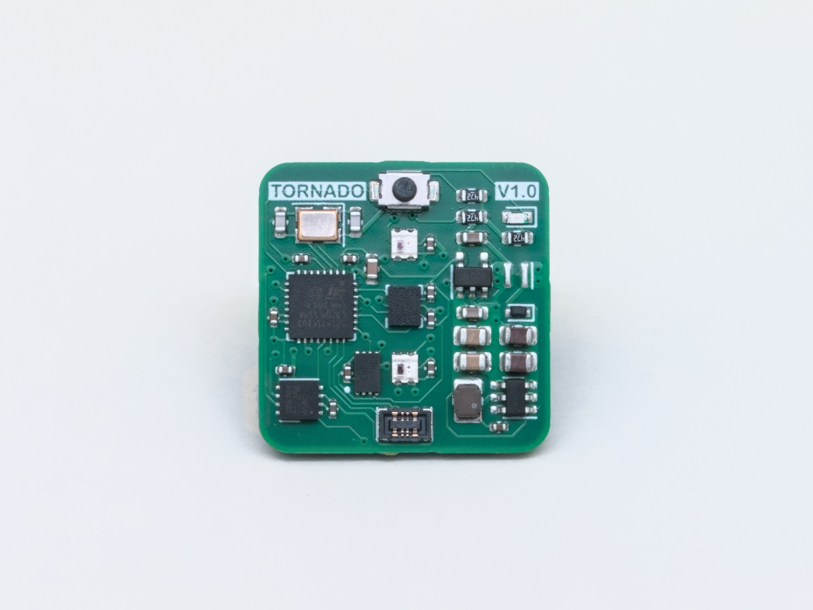

# Tornado

Tornado is a tiny open source IMU built for FRC! The design includes many features such as...
* __CAN FD support__
* __Efficient step-down dc-dc converter__
* __RGB LEDs__
* __EEPROM for persistent config__
* __Reverse voltage protection__
* __23mm x 23mm__

## Resources
* [Schematic](Images/Schematic.pdf)
* [Bill of Materials](https://docs.google.com/spreadsheets/d/1Hn63KbTJbFwAjQXVcAFpKeThpDb3CeomXEKE-9VibNg)