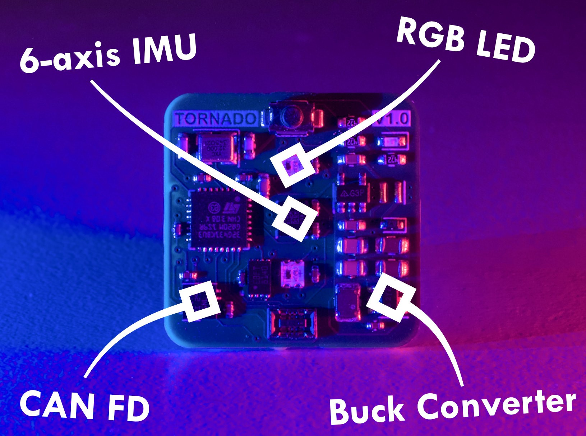

    <picture>
      <source media="(prefers-color-scheme: dark)" srcset="Images/logo-darkTheme.png">
      <source media="(prefers-color-scheme: light)" srcset="Images/logo-lightTheme.png">
      
    </picture>

---

Tornado is a tiny open source IMU built for FRC! The design includes many features such as...
* __CAN FD support__
* __Efficient buck converter__
* __RGB LEDs__
* __EEPROM for persistent config__
* __Reverse voltage protection__
* __23mm x 23mm size__

## Resources
* [Schematic](Images/Schematic.pdf)
* [Bill of Materials](https://docs.google.com/spreadsheets/d/1Hn63KbTJbFwAjQXVcAFpKeThpDb3CeomXEKE-9VibNg)